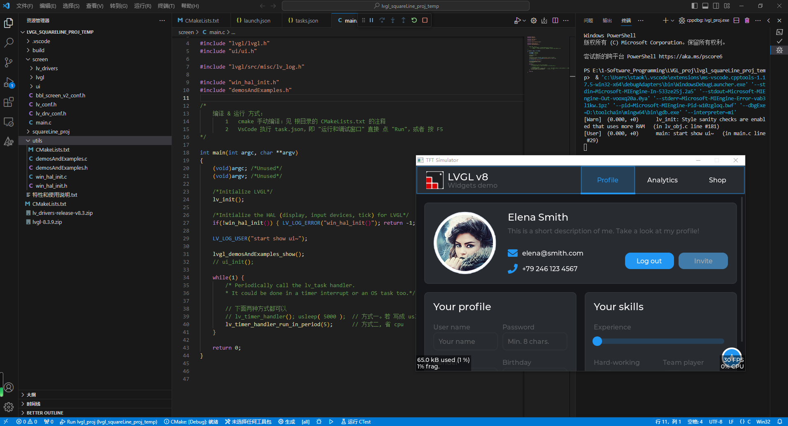

# lvgl_port_win_vscode
在 win 平台对 lvgl 方便的进行模拟显示，程序文件结构清晰，lvgl with SDL2，cmake 构建，VsCode 一键运行，使用 SquareLine 生成前端 UI 文件，win 上直接跑。

相比官方的 lvgl 移植到 win 端的几种方法 [Simulator on PC — LVGL documentation](https://docs.lvgl.io/8.3/get-started/platforms/pc-simulator.html)，本仓库带来更好的 lvgl 在 win 端的模拟显示 体验！

使用 SquareLine 生成前端 UI 文件，win 上直接跑。

仓库约 260MB 大小。

全部使用 手写的 cmake 构建，具有 学习 和 实践使用 意义。

## 使用说明

### 环境

首先，需要 pc 安装有 mingw-w64 和 cmake，以及 VsCode（带 `C/C++`、`C/C++ Extension Pack`、 `CMake` 等相关常用插件）。

我的一个 VsCode 跑一跑 C/C++ 程序的工程模板：见 [VsCode temp Proj(github.com)](https://github.com/Staok/coding-style-and-more/tree/main/VsCode temp Proj) 或  [VsCode temp Proj(gitee.com](https://gitee.com/staok/coding-style-and-more/tree/main/VsCode temp Proj)。

### 使用

github 仓库 https://github.com/Staok/lvgl_port_win_vscode。

gitee 仓库 https://gitee.com/staok/lvgl_port_win_vscode。

三个文件夹，为三个独立工程，分别可独立 编译 & 运行；每个文件夹里面都有说明，要看。

- 1-SDL2_lib_test_show，这是 测试运行 SDL2 库（win 端的创建窗口应用的库）的，装 SDL2 库、编译 和 运行 看 CMakeList 文件里面。
- 2-lvgl_sim_vscode_sdl_win_show，这是在官方 [VSCode with SDL driver](https://github.com/lvgl/lv_sim_vscode_sdl) 上的魔改，借鉴了一些网友的构建和例子，程序里均给出了参考链接。
- lvgl_squareLine_proj_temp，作为通用的 lvgl 工程模板。这是 集合官方最新 lvgl 库、lv_drivers 库、SDL2、SquareLine 生成的前端 UI 文件 的工程，以及添加了一些功能，cmake 构建，添加了 VsCode 的 task，一键 F5 运行。SquareLine 是 可视化的 lvgl 界面设置 软件，其直接生成 lvgl 可以运行的 界面代码。

lvgl_squareLine_proj_temp 目前还只支持在 win 端运行。

lvgl_squareLine_proj_temp 作为通用的 lvgl 工程模板，目标是 一个文件夹， win 端 和 嵌入式linux 端 或 mcu 端（经过交叉编译）均可以跑，即 pc 上 模拟显示 & 反复调整，下载到 嵌入式 linux 板子 或 mcu 板子 就跑。并且 UI 的前后端分离。做到通用化的一个 lvgl 小模板、小框架。

### 效果

一键 F5 —— 启动！

